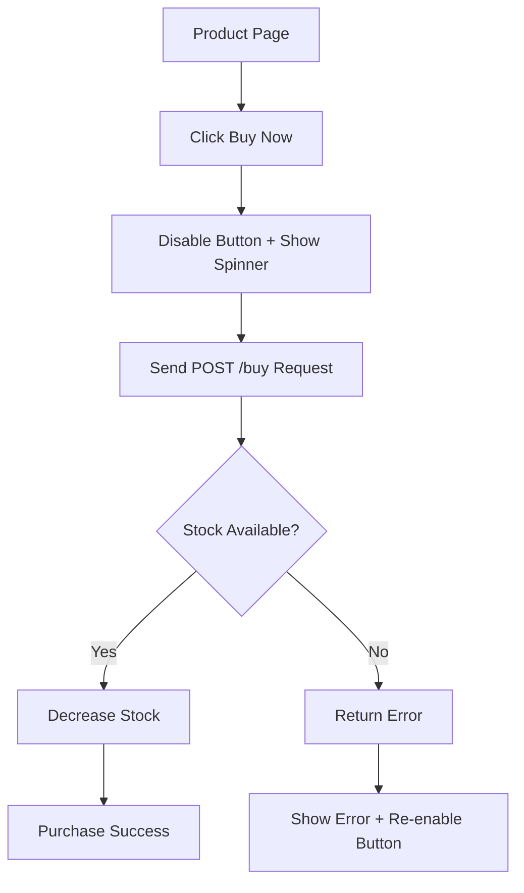

## 1. Product Overview
A limited-edition sneaker flash sale platform that creates urgency through real-time stock tracking and instant purchase functionality. Users can view the product and purchase immediately while seeing live inventory updates.

This product solves the problem of managing high-demand limited releases by providing a smooth, responsive buying experience with real-time stock visibility for sneaker enthusiasts and collectors.

## 2. Core Features

### 2.1 User Roles
| Role | Registration Method | Core Permissions |
|------|---------------------|------------------|
| Guest User | No registration required | View product details, purchase sneakers |

### 2.2 Feature Module
Our flash sale application consists of the following main pages:
1. **Product page**: Sneaker showcase, live stock counter, buy now functionality.

### 2.3 Page Details
| Page Name | Module Name | Feature description |
|-----------|-------------|---------------------|
| Product page | Hero section | Display high-quality sneaker images with zoom capability |
| Product page | Product details | Show sneaker name, limited edition info, original price |
| Product page | Stock counter | Display real-time remaining stock count starting from 100 |
| Product page | Buy button | Large, prominent button that triggers purchase process |
| Product page | Loading state | Show spinner and disable button during purchase processing |
| Product page | Error handling | Display error message if purchase fails, re-enable button |

## 3. Core Process
**User Purchase Flow:**
1. User lands on product page and sees sneaker details with live stock count
2. User clicks "Buy Now" button
3. Button immediately disables and shows loading spinner (optimistic UI)
4. Frontend sends POST request to /buy endpoint
5. Backend validates stock availability and processes purchase
6. If successful: stock count decreases, purchase completed
7. If failed: button re-enables, error message displayed

## 4. User Interface Design

### 4.1 Design Style
- **Primary color**: #FF6B35 (vibrant orange for urgency)
- **Secondary color**: #1A1A1A (dark for premium feel)
- **Button style**: Large, rounded rectangle with gradient effect
- **Font**: Inter or similar modern sans-serif
- **Layout**: Centered card-based design with full-width hero image
- **Icons**: Minimalist line icons for stock counter and loading states

### 4.2 Page Design Overview
| Page Name | Module Name | UI Elements |
|-----------|-------------|-------------|
| Product page | Hero section | Full-width sneaker image with subtle zoom effect on hover |
| Product page | Stock counter | Large, bold numbers with pulsing animation when stock decreases |
| Product page | Buy button | 300px wide, 60px tall, gradient background, white text |
| Product page | Loading state | Centered spinner with "Processing..." text overlay |

### 4.3 Responsiveness
Desktop-first design approach with mobile adaptation. The product page should maintain its impact on all screen sizes with responsive image scaling and touch-optimized button interactions.