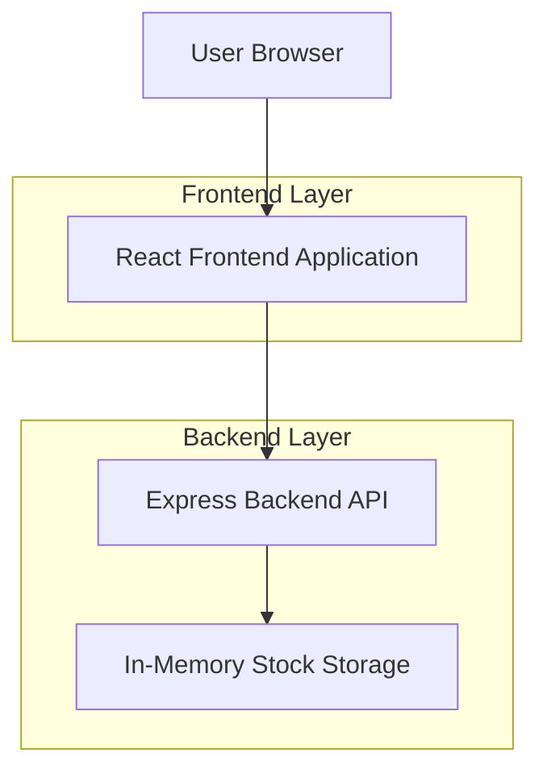
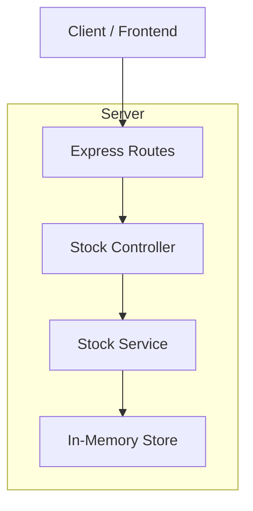
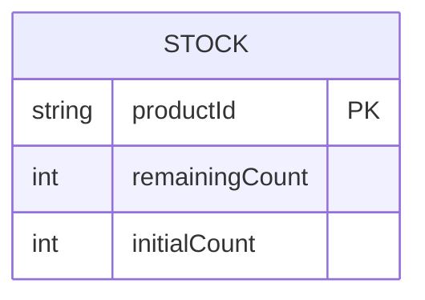

## 1. Architecture design



## 2. Technology Description
- Frontend: React@18 + Vite + TailwindCSS
- Initialization Tool: vite-init
- Backend: Node.js@18 + Express@4
- Database: In-memory storage (for MVP)

## 3. Route definitions
| Route | Purpose |
|-------|---------|
| / | Product page displaying sneaker and purchase interface |

## 4. API definitions

### 4.1 Core API

**Purchase Sneaker**
```
POST /buy
```

Request:
| Param Name | Param Type | isRequired | Description |
|------------|------------|-------------|-------------|
| productId | string | true | Product identifier (default: "sneaker-001") |

Response:
| Param Name | Param Type | Description |
|------------|-------------|-------------|
| success | boolean | Purchase status |
| message | string | Status message |
| remainingStock | number | Updated stock count |

Example Success Response:
```json
{
  "success": true,
  "message": "Purchase successful",
  "remainingStock": 99
}
```

Example Error Response:
```json
{
  "success": false,
  "message": "Out of stock",
  "remainingStock": 0
}
```

## 5. Server architecture diagram



## 6. Data model

### 6.1 Data model definition


### 6.2 Data Definition Language

**Stock Management (In-Memory)**
```javascript
// Server-side in-memory storage
let stockData = {
  "sneaker-001": {
    productId: "sneaker-001",
    remainingCount: 100,
    initialCount: 100
  }
};

// Stock operations
const decreaseStock = (productId) => {
  if (stockData[productId] && stockData[productId].remainingCount > 0) {
    stockData[productId].remainingCount--;
    return {
      success: true,
      remainingStock: stockData[productId].remainingCount
    };
  }
  return {
    success: false,
    message: "Out of stock",
    remainingStock: stockData[productId]?.remainingCount || 0
  };
};

const getStock = (productId) => {
  return stockData[productId]?.remainingCount || 0;
};
```