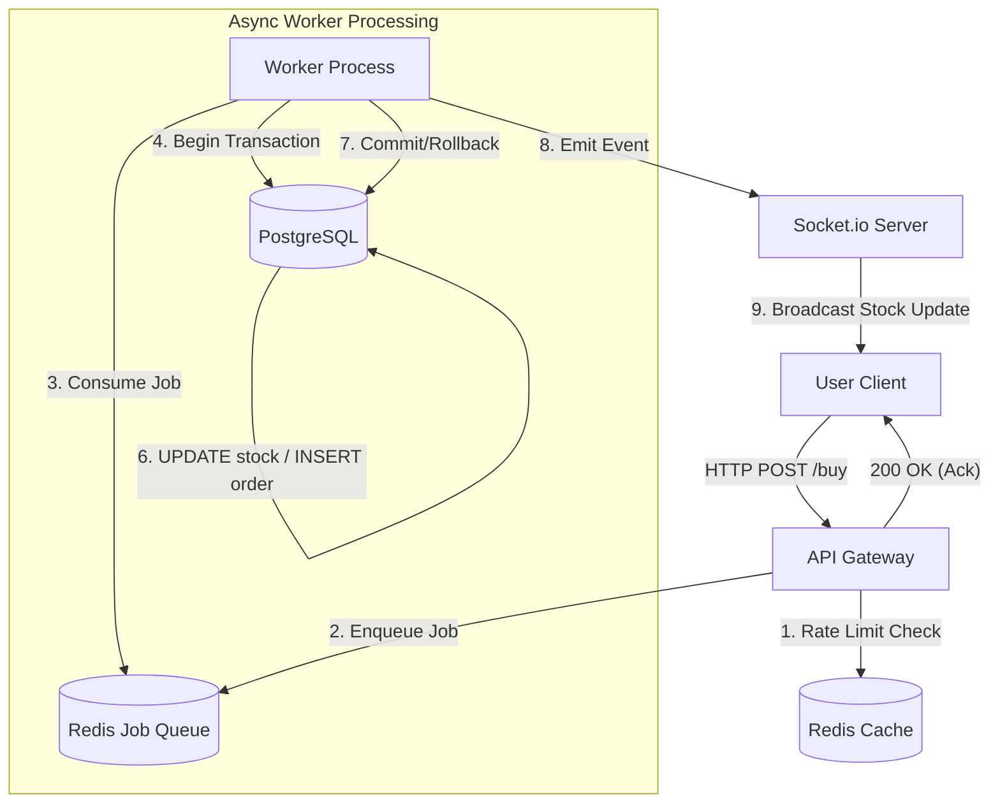

# 🏗️ System Architecture

This document details the architecture of the **High-Concurrency Flash Sale Engine**, designed to handle massive traffic spikes and ensure data consistency during inventory-constrained events.

## 1. Tech Stack

### **Frontend**
- **React + Vite**: High-performance client-side rendering with sub-second build times.
- **Tailwind CSS**: Utility-first styling for rapid UI development and responsive design.
- **Socket.io Client**: Real-time bidirectional event-based communication.

### **Backend**
- **Node.js + Express**: Event-driven, non-blocking I/O server optimized for high concurrency.
- **Socket.io Server**: Manages WebSocket connections for instant stock updates and sale status broadcasts.

### **Database & Caching**
- **PostgreSQL (Neon)**: Relational database with ACID compliance, utilizing **Row-Level Locking** (`SELECT ... FOR UPDATE`) to prevent race conditions.
- **Redis (Upstash)**: High-performance in-memory data store used for:
  - **Job Queue**: Buffering incoming purchase requests.
  - **Rate Limiting**: Preventing abuse and throttling traffic.
  - **Idempotency**: Ensuring unique request processing.
  - **State Management**: caching global sale status (Open/Closed).

### **Worker System**
- **BullMQ**: Robust, Redis-based job queue for processing asynchronous tasks.
- **Dedicated Worker Process**: Decouples request ingestion from order processing to prevent main thread blocking.

---

## 2. Concurrency Flow (The "Turnstile" Mechanism)

To handle thousands of concurrent requests without overwhelming the database, the system employs a "Turnstile" architecture:

1.  **Client Request**: User clicks "Buy". Frontend sends a POST request with an `Idempotency-Key`.
2.  **API Gateway (Express)**:
    -   **Rate Limit Check**: Redis checks if the user has exceeded request limits.
    -   **Idempotency Check**: Redis ensures this specific request ID hasn't been processed.
    -   **Queueing**: If valid, the request is pushed to the **Redis Job Queue** immediately.
    -   **Immediate Response**: The API returns `200 OK` (Acknowledged) to the client, preventing connection timeout.
3.  **Worker Process**:
    -   Consumes jobs from the Redis Queue one by one (or in controlled batches).
    -   **Database Transaction**:
        -   Opens a transaction.
        -   Acquires a **Pessimistic Lock** on the product row (`FOR UPDATE`).
        -   Checks stock > 0.
        -   Decrements stock and creates an Order record.
        -   Commits transaction.
4.  **Socket Broadcast**:
    -   On success, the worker emits a `stock-update` event to all connected clients via Socket.io.
    -   Emits a specific `order_confirmed` event to the purchasing user.

### **Flow Diagram**



---

## 3. Data Structure

### **Database Schema (PostgreSQL)**

The core product table enforces strict consistency and integer constraints.

```sql
CREATE TABLE products (
  id VARCHAR(255) PRIMARY KEY,
  name VARCHAR(255) NOT NULL,
  description TEXT,
  price INTEGER NOT NULL, -- Stored in cents to avoid floating point errors
  stock_quantity INTEGER NOT NULL CHECK (stock_quantity >= 0), -- Constraint prevents negative stock
  image TEXT
);

CREATE TABLE orders (
  id SERIAL PRIMARY KEY,
  user_id VARCHAR(255) NOT NULL,
  product_id VARCHAR(255) NOT NULL,
  status VARCHAR(50) DEFAULT 'PENDING', -- PENDING, COMPLETED, CANCELLED
  created_at TIMESTAMP DEFAULT CURRENT_TIMESTAMP
);
```

### **Job Queue Payload (Redis/JSON)**

The structure of the job pushed to Redis for processing.

```json
{
  "jobId": "uuid-v4-string",
  "data": {
    "userId": "user_2p9s8d7f6g5h4j3k2l",
    "productId": "sneaker-001",
    "timestamp": 1715423000000,
    "idempotencyKey": "ide_8s7d6f5g4h3j2k"
  },
  "name": "purchase-job",
  "opts": {
    "attempts": 3,
    "backoff": 1000
  }
}
```
